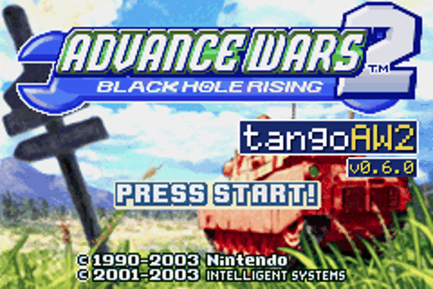
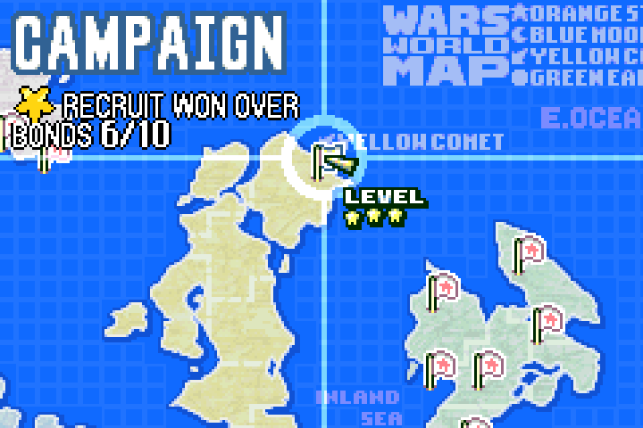
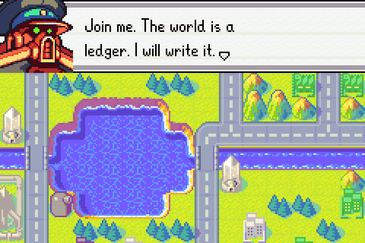
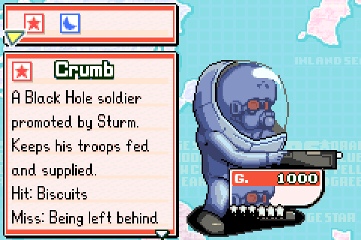
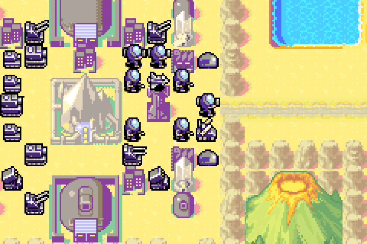
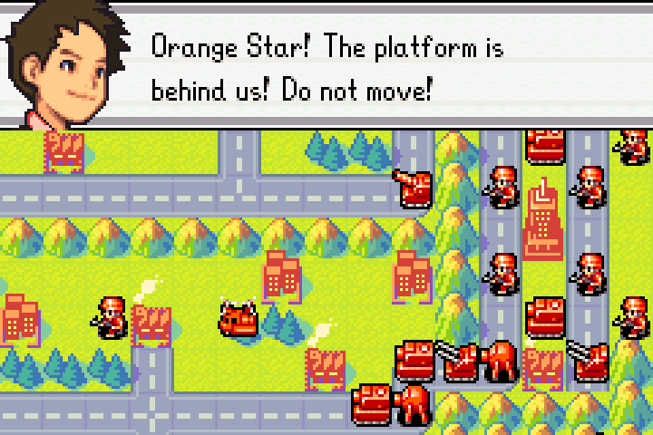
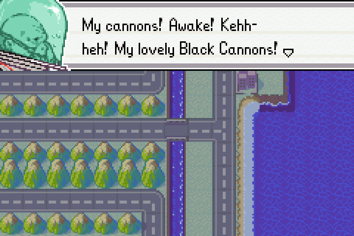

# tangoAW2

Rollback netplay for **Advance Wars 2: Black Hole Rising** (GBA, USA).

A fork of [Tango](https://github.com/tangobattle/tango) (mGBA, rollback,
matchmaking) for Advance Wars 2. Both players run the real game in its own
Versus mode; your ROM is never modified (changes are applied in memory).
No game is included: you need your own dump of the USA cartridge.

<table>
<tr>
<td></td>
<td></td>
</tr>
</table>

## Get it

Download the latest build from
[Releases](https://github.com/rkoh46/tangoAW2/releases/latest) (what
changed is in each release's notes): Windows (`.exe` installer), macOS on
Apple Silicon (`.dmg`, not signed: right-click the app and choose Open the
first time), Linux (`.AppImage`), or iPhone and iPad (`.ipa`, iOS 16 or
later: install it with [AltStore](https://altstore.io),
[SideStore](https://sidestore.io) or [Sideloadly](https://sideloadly.io);
it plays with on-screen buttons or a controller at 60 to 120 Hz, sideways
fitted between the buttons or stretched (Settings > Graphics), and online with
desktop players).

## First run

1. Open tangoAW2 and pick a nickname.
2. Put your Advance Wars 2 ROM in the `roms` folder the welcome screen
   shows: No-Intro `Advance Wars 2 - Black Hole Rising (USA)`, CRC32
   `5AD0E571`.
   (on iPhone, import it from the welcome screen; the Dual Strike `.nds`
   goes there too).
3. Press **Play offline** to play alone, or see below to play a friend.

## Playing online

You both need tangoAW2 (same version) and your own copy of the ROM.

- **Link code:** both type the same made-up code (say `sturm-4812`) on the
  Play tab. Works through most home routers with no setup.
- **Direct:** one player types `/host`, the other `/connect <their IP>`
  (UDP port 24680 must be reachable: same network, a VPN such as
  Tailscale, or a forwarded port).

Both press Ready; the game starts from power-on for both. Go to
**Versus → New**, pick a map, and on the **Teams** screen set army 2 to
**2P**. Player 1 moves armies 1, 3 and 5; player 2 moves armies 2 and 4.

On the map only the moving army's player can press anything; menus are
shared. With fog on, the waiting player's screen is covered during the
other army's turn. The match runs on player 1's save (and design maps).

## What it adds

- **Everything unlocked:** all COs including Sturm, CO colour edits,
  Battle Maps, Hard Campaign and the Sound Room.
- **Black Hole as a Versus army** and **five-army maps** (a 5P Maps tab in
  Versus: press LEFT on the tab list), any army human or computer.
- **Design Room:** Black Hole as a fifth army and its inventions
  (minicannons, Laser, Black Cannons, Black Factory, Volcano, Deathray),
  which work in Versus as in the campaign.
- **An Advance Wars look** for the app, or your own background image.

With your own Advance Wars: Dual Strike (USA) `.nds` in the `roms` folder,
Dual Strike comes to AW2 (converted on your computer; without it nothing
changes, and online both players need it):

- **Units, COs and terrain:** its 7 units and 9 new COs with their
  pictures, animations, music and numbers; Com Towers, Sandstorm, its
  weather and fog looks, Wasteland, Desert and Snow terrain, the Black
  Crystal and Obelisk, Black Hole's structures as Dual Strike draws them;
  eight new Versus maps.
- **Survival:** Money, Turn and Time, eleven maps each, with ranks and
  records, on screens like Dual Strike's; clear a course to open its endless
  Champion course.
- **Black Factory (Versus):** same schedule and cost, but it picks what the
  battle needs; 200 hit points, destructible; human Black Hole armies too.
- **The computer goes for your inventions** when you are Black Hole (the BH
  Campaign, and Versus against a computer): it marches on your Black
  Cannons, Obelisks, Crystals and Black Factory, artillery setting up in
  range and tanks coming in from the side of a cannon's line, and hits them.
- **DS Campaign:** all 28 missions on Dual Strike's world map:
  - missions open as you advance, with LEVEL stars for each; Hard
    campaign once Normal is cleared;
  - the story scenes, prologue, ending with a choice, credits and music;
  - mission records, and saving mid-mission;
  - each mission opens with Dual Strike's Setup phase: look around, then
    **Deploy**.
- **BH Campaign:** a second campaign where you lead Black Hole:
  - 31 missions in five acts across the four nations, plus a secret 31st
    that opens once every recruit's bond is earned;
  - recruits (Von Bolt, Hawke, Koal, Kindle and more) with hidden bonds,
    and **Crumb**, a CO of his own;
  - set rivalries and free picks: your CO or tag pair on the CO screen
    changes who you fight and what is said;
  - two fronts, fog, a five-army fortress with Obelisk, Volcano and
    Factory, and a finale where Andy takes Orange Star over;
  - every scene is written for it (pick it in the Campaign menu).
- **Two-front missions** are fought on both fronts, taking turns each round:
  - **Front** on the map menu looks at the other front; **Send** moves
    units over;
  - in Lightning Strikes and Ring of Fire, **Intel → Auto CO** off lets
    you command the second front yourself;
  - while the computer runs it, **Intel → General** sets how it fights
    (Strike, Assault, General or Defense).
- **Mission specials:** the real Grand Bolt in Means to an End; Crystal
  Calamity's Black Onyx with its countdown, its laser every ten minutes
  and the missile silos that hit it; Reclaim the Skies' 30-minute limit.
- **CO skills:** Dual Strike's 40 skills, earned with EXP. **SELECT** on a
  CO screen (on Teams, on an army's CO) opens SET SKILLS; Versus' Rules
  screen turns them on (off by default).
- **CO tag pairs:** on Teams press **START** on a CO, then **UP**/**DOWN**
  for a partner:
  - **Change** swaps COs; with both meters full **Tag** fires a Tag Power,
    with Dual Strike's pair boosts;
  - the Tag Power and CO SWAP screens are animated, with Dual Strike's
    sounds;
  - Sturm gets pairs of his own.

<table>
<tr>
<td></td>
<td></td>
<td></td>
</tr>
<tr>
<td></td>
<td></td>
<td></td>
</tr>
</table>

<table>
<tr>
<td></td>
<td></td>
<td></td>
</tr>
<tr>
<td></td>
<td></td>
<td></td>
</tr>
</table>

## Controls

Default keys: A/B = Z/X, L/R = A/S, START/SELECT = Enter/Space (change
them in Settings). On Versus' Teams screen **R** or **L** changes an
army's colour, Black Hole included (without Dual Strike, **SELECT** too).

Design Room: **R** opens the terrain bar (the inventions come after Silo),
**L** the unit bar, **SELECT** or **UP** changes army, **A** places. Save
with **SELECT → File → Save**; play it from **Versus → Design Maps**.

## Known limits

- USA cartridge only; two human players online (more armies can be
  computer-controlled).
- Five-army battles and Survival runs can't be suspended.
- The mini maps show Black Hole's buildings in neutral grey.
- Dual Strike's top-screen pictures (the Black Onyx's Earth view) are left
  out, and tag powers play AW2's power music.
- Where a computer owns the Black Factory it strikes an enemy one only in range; Survival's
  records are per course, not per map; Champion courses open when their
  basic course is cleared (Dual Strike sells them in its shop).

## How it's tested

Every change is played offline and online and checked by scripted runs of
the real game (`tools/aw2test`, with and without Dual Strike): rollback
peers over a jittery fake network must end byte-for-byte identical, games
without Dual Strike are compared byte for byte with the previous release,
and a test bot wins most DS missions through the pad. The checks are in
[CONTRIBUTING.md](CONTRIBUTING.md); how it all works is in
[docs/AW2.md](docs/AW2.md).

Most of the code and research was written with an AI coding assistant
(Claude) under the maintainer's direction. Bug reports, especially "this
doesn't play like the real game", are welcome on the tangoAW2 thread on
the Wars World News forums.

## Building from source

Install Rust stable, CMake, Ninja and `protoc`, then
`cargo run --release --bin tango`. To test netplay on one computer, start
two copies with `TANGOAW2_PROFILE` set to different folders, then `/host`
in one and `/connect 127.0.0.1` in the other. The iPhone/iPad build
(`ios/build.sh`, needs Xcode) is described in [ios/README.md](ios/README.md).

## License

GPL-3.0-or-later, like Tango. See [LICENSE](LICENSE) and
[CREDITS.md](CREDITS.md). Advance Wars is a trademark of Nintendo.
tangoAW2 is not affiliated with Nintendo or Intelligent Systems.

Crumb art by the tangoAW2 author (rkoh), original: `tango-gamesupport-aw2/art/crumb/`.
It is the only art in the repository; every other picture is converted at
run time from the player's own ROMs.
